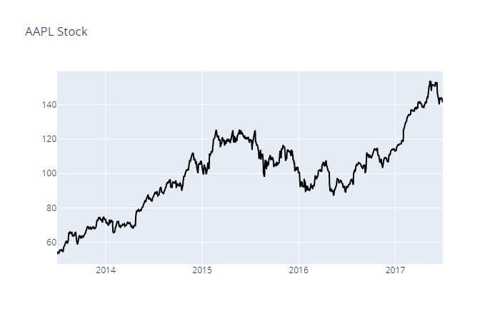

# Designing Breakout Strategy

The project implements a breakout strategy after finding and removing any outliers. Potential profite is examined using a Histogram and P-Value.

## Data Set
End of day from Quotemedia

New stocks are created to simulate many possible senarios. Example is a scenario where companies mining [Terbium](https://en.wikipedia.org/wiki/Terbium) are making huge profits. All the companies in this sector of the market are made up. They represent a sector with large growth that will be used for demonstration latter in this project.

The following is a snapshot for a sample closing price for one tick

## The Alpha Research Process

The signal-to-noise ratio in trading signals is very low and, as such, one can very easily fall into the trap of _overfitting_ to noise. To help mitigate overfitting, the following questions provide some insight for formulating general hypothesis:

> What feature of markets or investor behaviour would lead to a persistent anomaly that my signal will try to use?

Assuming that the first three steps area already done ("observe & research", "form hypothesis", "validate hypothesis"), the following can be tested:

- In the absence of news or significant investor trading interest, stocks oscillate in a range.
- Traders seek to capitalize on this range-bound behaviour periodically by selling/shorting at the top of the range and buying/covering at the bottom of the range. This behaviour reinforces the existence of the range.
- When stocks break out of the range, due to, e.g., a significant news release or from market pressure from a large investor:
    - the liquidity traders who have been providing liquidity at the bounds of the range seek to cover their positions to mitigate losses, thus magnifying the move out of the range, _and_
    - the move out of the range attracts other investor interest; these investors, due to the behavioural bias of _herding_ (e.g., [Herd Behavior](https://www.investopedia.com/university/behavioral_finance/behavioral8.asp)) build positions which favor continuation of the trend.

## Breakout Strategy

The price highs and lows are used as an indicator for the breakout strategy. 

## Install Requirements
`!{sys.executable} -m pip install -r requirements.txt`

The other packages that we're importing are `helper`, `project_helper`, and `project_tests`. These are custom packages built to help you solve the problems.  The `helper` and `project_helper` module contains utility functions and graph functions. The `project_tests` contains the unit tests for all the problems.

## Reference
[Artificial Intelligence for Trading on Udacity](https://www.udacity.com/course/ai-for-trading--nd880)